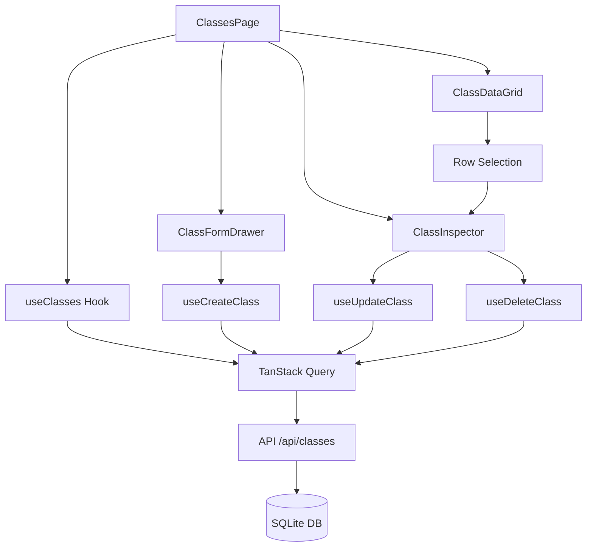

# Design Document: Classes Page

## Overview

The Classes Page is a feature module within the Maktab timetable application
that provides a comprehensive interface for managing school class groups. Built
following the Hybrid Manager Pattern with RTL-first design, it consists of a
main DataGrid for listing classes, a left-side Inspector panel for detailed
editing, and a drawer component for class creation.

The implementation follows React best practices with component-based
architecture, TanStack Query for server state management, Zustand for UI state,
and full i18n support with Persian/Dari as the default language.

## Architecture

```
┌─────────────────────────────────────────────────────────────────┐
│                         ClassesPage                              │
├─────────────────────────────────────────────────────────────────┤
│  ┌──────────────┐  ┌─────────────────────┐  ┌────────────────┐ │
│  │ ClassFilters │  │   ClassDataGrid     │  │ ClassInspector │ │
│  │  (Tabs)      │  │   (Main Content)    │  │  (Left Panel)  │ │
│  └──────────────┘  └─────────────────────┘  └────────────────┘ │
│                                                                  │
│  ┌──────────────────────────────────────────────────────────┐   │
│  │              ClassFormDrawer (Overlay)                    │   │
│  │              ~30% width from left                         │   │
│  └──────────────────────────────────────────────────────────┘   │
└─────────────────────────────────────────────────────────────────┘
```

### Data Flow



## Components and Interfaces

### Component Hierarchy

```
src/features/classes/
├── index.ts                    # Public exports
├── api.ts                      # API functions
├── types.ts                    # TypeScript types
├── hooks/
│   ├── useClasses.ts           # Data fetching hooks
│   └── useClassFilters.ts      # Filter state hook
├── components/
│   ├── ClassesPage.tsx         # Main page container
│   ├── ClassDataGrid.tsx       # DataGrid wrapper
│   ├── ClassFilters.tsx        # Grade category tabs
│   ├── ClassInspector.tsx      # Detail panel
│   ├── ClassFormDrawer.tsx     # Creation drawer
│   ├── ClassForm.tsx           # Reusable form
│   ├── SubjectRequirementsEditor.tsx  # Subject config
│   └── ui/
│       ├── GradeBadge.tsx      # Grade category badge
│       ├── SingleTeacherBadge.tsx  # Mode indicator
│       └── RoomSelector.tsx    # Room dropdown
└── utils/
    ├── gradeCategory.ts        # Grade categorization
    ├── serialization.ts        # JSON serialization
    └── logger.ts               # Debug logging
```

### Core Interfaces

```typescript
// types.ts

export interface ClassGroup {
  id: number;
  schoolId: number | null;
  academicYearId: number | null;
  name: string;
  displayName: string;
  section: 'PRIMARY' | 'MIDDLE' | 'HIGH' | '';
  grade: number | null;
  sectionIndex: string;
  studentCount: number;
  fixedRoomId: number | null;
  singleTeacherMode: boolean;
  classTeacherId: number | null;
  subjectRequirements: SubjectRequirement[];
  meta: Record<string, unknown>;
  isDeleted: boolean;
  deletedAt: string | null;
  createdAt: string;
  updatedAt: string;
}

export interface SubjectRequirement {
  subjectId: number;
  periodsPerWeek: number;
  teacherId?: number | null;
}

export interface ClassFormValues {
  name: string;
  displayName?: string;
  grade: number | null;
  sectionIndex: string;
  studentCount: number;
  fixedRoomId: number | null;
  singleTeacherMode: boolean;
  classTeacherId: number | null;
  subjectRequirements: SubjectRequirement[];
}

export type GradeCategory =
  | 'all'
  | 'alphaPrimary' // 1-3
  | 'betaPrimary' // 4-6
  | 'middle' // 7-9
  | 'high'; // 10-12

export interface ClassFiltersState {
  search: string;
  gradeCategory: GradeCategory;
}
```

### API Functions

```typescript
// api.ts

import { api } from '@/lib/api';
import { ClassGroup, ClassFormValues } from './types';
import {
  serializeSubjectRequirements,
  deserializeSubjectRequirements,
} from './utils/serialization';
import { logger } from './utils/logger';

export const classesApi = {
  getAll: async (): Promise<ClassGroup[]> => {
    logger.debug('Fetching all classes');
    const response = await api.get<ClassGroupResponse[]>('/api/classes');
    logger.debug('Fetched classes', { count: response.length });
    return response.map(deserializeClass);
  },

  getById: async (id: number): Promise<ClassGroup> => {
    logger.debug('Fetching class', { id });
    const response = await api.get<ClassGroupResponse>(`/api/classes/${id}`);
    return deserializeClass(response);
  },

  create: async (data: ClassFormValues): Promise<ClassGroup> => {
    logger.debug('Creating class', { name: data.name });
    const payload = serializeClassForApi(data);
    const response = await api.post<ClassGroupResponse>(
      '/api/classes',
      payload
    );
    logger.info('Class created', { id: response.id, name: response.name });
    return deserializeClass(response);
  },

  update: async (
    id: number,
    data: Partial<ClassFormValues>
  ): Promise<ClassGroup> => {
    logger.debug('Updating class', { id });
    const payload = serializeClassForApi(data);
    const response = await api.put<ClassGroupResponse>(
      `/api/classes/${id}`,
      payload
    );
    logger.info('Class updated', { id });
    return deserializeClass(response);
  },

  delete: async (id: number): Promise<void> => {
    logger.debug('Deleting class', { id });
    await api.delete(`/api/classes/${id}`);
    logger.info('Class deleted', { id });
  },
};

function deserializeClass(response: ClassGroupResponse): ClassGroup {
  return {
    ...response,
    subjectRequirements: deserializeSubjectRequirements(
      response.subjectRequirements
    ),
    meta: JSON.parse(response.meta || '{}'),
  };
}

function serializeClassForApi(
  data: Partial<ClassFormValues>
): Record<string, unknown> {
  return {
    ...data,
    subjectRequirements: data.subjectRequirements
      ? serializeSubjectRequirements(data.subjectRequirements)
      : undefined,
  };
}
```

### Hooks

```typescript
// hooks/useClasses.ts

import { useQuery, useMutation, useQueryClient } from '@tanstack/react-query';
import { classesApi } from '../api';
import { ClassFormValues } from '../types';
import { logger } from '../utils/logger';

export const CLASSES_QUERY_KEY = ['classes'];

export function useClasses() {
  return useQuery({
    queryKey: CLASSES_QUERY_KEY,
    queryFn: classesApi.getAll,
  });
}

export function useClass(id: number | null) {
  return useQuery({
    queryKey: [...CLASSES_QUERY_KEY, id],
    queryFn: () => classesApi.getById(id!),
    enabled: id !== null,
  });
}

export function useCreateClass() {
  const queryClient = useQueryClient();

  return useMutation({
    mutationFn: (data: ClassFormValues) => classesApi.create(data),
    onSuccess: () => {
      logger.debug('Invalidating classes cache after create');
      queryClient.invalidateQueries({ queryKey: CLASSES_QUERY_KEY });
    },
    onError: (error) => {
      logger.error('Failed to create class', { error });
    },
  });
}

export function useUpdateClass() {
  const queryClient = useQueryClient();

  return useMutation({
    mutationFn: ({
      id,
      data,
    }: {
      id: number;
      data: Partial<ClassFormValues>;
    }) => classesApi.update(id, data),
    onSuccess: () => {
      logger.debug('Invalidating classes cache after update');
      queryClient.invalidateQueries({ queryKey: CLASSES_QUERY_KEY });
    },
    onError: (error) => {
      logger.error('Failed to update class', { error });
    },
  });
}

export function useDeleteClass() {
  const queryClient = useQueryClient();

  return useMutation({
    mutationFn: (id: number) => classesApi.delete(id),
    onSuccess: () => {
      logger.debug('Invalidating classes cache after delete');
      queryClient.invalidateQueries({ queryKey: CLASSES_QUERY_KEY });
    },
    onError: (error) => {
      logger.error('Failed to delete class', { error });
    },
  });
}
```

## Data Models

### Database Entity (existing)

The `ClassGroup` entity in `packages/api/src/entity/ClassGroup.ts` stores:

- Basic info: `name`, `displayName`, `grade`, `section`, `sectionIndex`
- Student info: `studentCount`
- Room assignment: `fixedRoomId`
- Teacher mode: `singleTeacherMode`, `classTeacherId`
- Subject config: `subjectRequirements` (JSON string)
- Metadata: `meta` (JSON string)
- Soft delete: `isDeleted`, `deletedAt`
- Timestamps: `createdAt`, `updatedAt`

### Zod Validation Schema

```typescript
// schemas/class.schema.ts (frontend)

import { z } from 'zod';

export const subjectRequirementSchema = z.object({
  subjectId: z.number().int().positive(),
  periodsPerWeek: z.number().int().min(1).max(20),
  teacherId: z.number().int().positive().nullable().optional(),
});

export const classFormSchema = z.object({
  name: z
    .string()
    .min(1, 'classes.validation.nameRequired')
    .max(255, 'classes.validation.nameTooLong'),
  displayName: z.string().max(100).optional(),
  grade: z.number().int().min(1).max(12).nullable(),
  sectionIndex: z.string().max(10).optional().default(''),
  studentCount: z.number().int().min(0).max(500).default(0),
  fixedRoomId: z.number().int().nullable().optional(),
  singleTeacherMode: z.boolean().default(false),
  classTeacherId: z.number().int().nullable().optional(),
  subjectRequirements: z.array(subjectRequirementSchema).default([]),
});

export type ClassFormValues = z.infer<typeof classFormSchema>;
```

### Grade Category Utility

```typescript
// utils/gradeCategory.ts

import { GradeCategory } from '../types';

export function getGradeCategory(grade: number | null): GradeCategory {
  if (grade === null) return 'all';
  if (grade >= 1 && grade <= 3) return 'alphaPrimary';
  if (grade >= 4 && grade <= 6) return 'betaPrimary';
  if (grade >= 7 && grade <= 9) return 'middle';
  if (grade >= 10 && grade <= 12) return 'high';
  return 'all';
}

export function isGradeInCategory(
  grade: number | null,
  category: GradeCategory
): boolean {
  if (category === 'all') return true;
  return getGradeCategory(grade) === category;
}

export function shouldEnableSingleTeacherMode(grade: number | null): boolean {
  return grade !== null && grade >= 1 && grade <= 3;
}

export const GRADE_CATEGORY_COLORS: Record<GradeCategory, string> = {
  all: 'bg-gray-100 text-gray-800',
  alphaPrimary: 'bg-green-100 text-green-800',
  betaPrimary: 'bg-blue-100 text-blue-800',
  middle: 'bg-purple-100 text-purple-800',
  high: 'bg-orange-100 text-orange-800',
};
```

## Correctness Properties

_A property is a characteristic or behavior that should hold true across all
valid executions of a system-essentially, a formal statement about what the
system should do. Properties serve as the bridge between human-readable
specifications and machine-verifiable correctness guarantees._

Based on the prework analysis, the following correctness properties have been
identified:

### Property 1: Search Filtering Correctness

_For any_ class list and search term, all classes returned by the search filter
should contain the search term in at least one of: name, displayName, or
sectionIndex fields (case-insensitive). **Validates: Requirements 1.2**

### Property 2: Grade Category Filtering Correctness

_For any_ class list and grade category filter, all classes returned should have
a grade that falls within the selected category range (alphaPrimary: 1-3,
betaPrimary: 4-6, middle: 7-9, high: 10-12). **Validates: Requirements 1.3,
5.2**

### Property 3: Single-Teacher Mode Auto-Enable

_For any_ grade value between 1 and 3 (inclusive), the
`shouldEnableSingleTeacherMode` function should return true; for any grade
outside this range or null, it should return false. **Validates: Requirements
2.5, 5.4**

### Property 4: Grade Category Classification

_For any_ valid grade (1-12), the `getGradeCategory` function should return the
correct category: alphaPrimary for 1-3, betaPrimary for 4-6, middle for 7-9,
high for 10-12. **Validates: Requirements 5.3, 5.4**

### Property 5: Subject Requirements Round-Trip Serialization

_For any_ valid array of SubjectRequirement objects, serializing to JSON string
and then deserializing back should produce an equivalent array with the same
subjectId, periodsPerWeek, and teacherId values for each element. **Validates:
Requirements 12.1, 12.2, 12.3**

### Property 6: Class Creation Adds to List

_For any_ valid ClassFormValues, after successful creation via the API, the
classes list should contain a class with matching name, grade, and other
properties. **Validates: Requirements 2.3**

### Property 7: Class Update Persists Changes

_For any_ existing class and valid partial update, after successful update via
the API, fetching the class should return the updated values for all modified
fields. **Validates: Requirements 3.3**

### Property 8: Class Deletion Removes from List

_For any_ existing class, after successful deletion via the API, the class
should no longer appear in the non-deleted classes list. **Validates:
Requirements 4.2**

### Property 9: Numeral Conversion Consistency

_For any_ number and locale setting, converting to the locale's numeral system
and back should produce the original number. **Validates: Requirements 9.4**

### Property 10: API Error Handling

_For any_ API error response, the system should display a localized error
message corresponding to the error type. **Validates: Requirements 10.4, 11.3**

## Error Handling

### API Error Handling

```typescript
// utils/errorHandler.ts

import { logger } from './logger';

export interface ApiError {
  code: string;
  message: string;
  details?: Record<string, unknown>;
}

export function handleApiError(error: unknown, t: TFunction): string {
  logger.error('API Error', { error });

  if (isApiError(error)) {
    const translationKey = `classes.errors.${error.code}`;
    return t(translationKey, { defaultValue: error.message });
  }

  if (error instanceof Error) {
    return t('common.errors.unexpected', { defaultValue: error.message });
  }

  return t('common.errors.unknown');
}

function isApiError(error: unknown): error is ApiError {
  return (
    typeof error === 'object' &&
    error !== null &&
    'code' in error &&
    'message' in error
  );
}
```

### Validation Error Display

```typescript
// Form validation errors are displayed inline using react-hook-form
// with Zod resolver, showing localized messages from i18n

const form = useForm<ClassFormValues>({
  resolver: zodResolver(classFormSchema),
  defaultValues: {
    name: '',
    grade: null,
    sectionIndex: '',
    studentCount: 0,
    singleTeacherMode: false,
  },
});
```

### Malformed JSON Handling

```typescript
// utils/serialization.ts

export function deserializeSubjectRequirements(
  json: string
): SubjectRequirement[] {
  if (!json || json === '') {
    return [];
  }

  try {
    const parsed = JSON.parse(json);
    if (!Array.isArray(parsed)) {
      logger.warn('subjectRequirements is not an array, returning empty', {
        json,
      });
      return [];
    }
    return parsed;
  } catch (error) {
    logger.warn('Failed to parse subjectRequirements JSON', { json, error });
    return [];
  }
}

export function serializeSubjectRequirements(
  requirements: SubjectRequirement[]
): string {
  return JSON.stringify(requirements);
}
```

## Testing Strategy

### Dual Testing Approach

The Classes Page feature uses both unit tests and property-based tests to ensure
comprehensive coverage:

1. **Unit Tests**: Verify specific examples, edge cases, and integration points
2. **Property-Based Tests**: Verify universal properties that should hold across
   all inputs

### Property-Based Testing Framework

- **Library**: fast-check (JavaScript/TypeScript PBT library)
- **Minimum Iterations**: 100 per property test
- **Location**: `src/features/classes/__tests__/`

### Test File Structure

```
src/features/classes/__tests__/
├── unit/
│   ├── ClassForm.test.tsx
│   ├── ClassDataGrid.test.tsx
│   ├── ClassInspector.test.tsx
│   └── gradeCategory.test.ts
├── property/
│   ├── searchFilter.property.test.ts
│   ├── gradeCategory.property.test.ts
│   ├── serialization.property.test.ts
│   └── singleTeacherMode.property.test.ts
└── integration/
    └── classesApi.integration.test.ts
```

### Property Test Annotations

Each property-based test must be tagged with a comment referencing the
correctness property:

```typescript
// **Feature: classes-page, Property 1: Search Filtering Correctness**
test.prop([fc.array(classGroupArb), fc.string()], { numRuns: 100 })(
  'search filter returns only matching classes',
  (classes, searchTerm) => {
    const filtered = filterClassesBySearch(classes, searchTerm);
    return filtered.every(
      (c) =>
        c.name.toLowerCase().includes(searchTerm.toLowerCase()) ||
        c.displayName.toLowerCase().includes(searchTerm.toLowerCase()) ||
        c.sectionIndex.toLowerCase().includes(searchTerm.toLowerCase())
    );
  }
);
```

### Unit Test Examples

```typescript
// gradeCategory.test.ts
describe('getGradeCategory', () => {
  it('returns alphaPrimary for grade 1', () => {
    expect(getGradeCategory(1)).toBe('alphaPrimary');
  });

  it('returns high for grade 12', () => {
    expect(getGradeCategory(12)).toBe('high');
  });

  it('returns all for null grade', () => {
    expect(getGradeCategory(null)).toBe('all');
  });
});
```

### Generators for Property Tests

```typescript
// test-utils/generators.ts
import * as fc from 'fast-check';
import { SubjectRequirement, ClassGroup, GradeCategory } from '../types';

export const subjectRequirementArb: fc.Arbitrary<SubjectRequirement> =
  fc.record({
    subjectId: fc.integer({ min: 1, max: 1000 }),
    periodsPerWeek: fc.integer({ min: 1, max: 20 }),
    teacherId: fc.option(fc.integer({ min: 1, max: 1000 }), { nil: null }),
  });

export const gradeArb: fc.Arbitrary<number | null> = fc.oneof(
  fc.constant(null),
  fc.integer({ min: 1, max: 12 })
);

export const gradeCategoryArb: fc.Arbitrary<GradeCategory> = fc.constantFrom(
  'all',
  'alphaPrimary',
  'betaPrimary',
  'middle',
  'high'
);

export const classGroupArb: fc.Arbitrary<ClassGroup> = fc.record({
  id: fc.integer({ min: 1 }),
  name: fc.string({ minLength: 1, maxLength: 50 }),
  displayName: fc.string({ maxLength: 100 }),
  grade: gradeArb,
  sectionIndex: fc.stringOf(fc.constantFrom('A', 'B', 'C', 'D'), {
    maxLength: 2,
  }),
  studentCount: fc.integer({ min: 0, max: 500 }),
  // ... other fields
});
```

## i18n Keys

The following translation keys should be added to the classes namespace:

```json
{
  "classes": {
    "pageTitle": "مدیریت صنف‌ها",
    "pageSubtitle": "مدیریت گروه‌های کلاسی و تنظیمات",
    "title": "صنف‌ها",
    "description": "پیکربندی گروه‌های کلاسی و درجات",
    "add": "صنف جدید",
    "edit": "ویرایش صنف",
    "delete": "حذف صنف",
    "deleteConfirmation": "آیا مطمئن هستید که می‌خواهید این صنف را حذف کنید؟",
    "noClasses": "هیچ صنفی یافت نشد",
    "selectClass": "برای مشاهده جزئیات یک صنف را انتخاب کنید",

    "columns": {
      "name": "نام صنف",
      "displayName": "نام نمایشی",
      "grade": "پایه",
      "sectionIndex": "بخش",
      "studentCount": "تعداد شاگردان",
      "classTeacher": "معلم راهنما",
      "fixedRoom": "اتاق ثابت"
    },

    "filters": {
      "all": "همه صنف‌ها",
      "alphaPrimary": "ابتدایی الف (۱-۳)",
      "betaPrimary": "ابتدایی ب (۴-۶)",
      "middle": "متوسطه (۷-۹)",
      "high": "لیسه (۱۰-۱۲)",
      "search": "جستجو در نام، شناسه..."
    },

    "form": {
      "name": "نام صنف",
      "namePlaceholder": "مثلاً: صنف ۷-الف",
      "grade": "پایه تحصیلی",
      "gradePlaceholder": "انتخاب پایه",
      "sectionIndex": "شاخص بخش",
      "sectionIndexPlaceholder": "مثلاً: الف، ب، ج",
      "studentCount": "تعداد شاگردان",
      "fixedRoom": "اتاق ثابت (Homeroom)",
      "fixedRoomPlaceholder": "انتخاب اتاق",
      "noRoom": "بدون اتاق ثابت",
      "singleTeacherMode": "حالت تک‌معلم",
      "singleTeacherModeDesc": "یک معلم تمام مضامین را تدریس می‌کند",
      "classTeacher": "معلم راهنما",
      "classTeacherPlaceholder": "انتخاب معلم"
    },

    "tabs": {
      "basicInfo": "اطلاعات پایه",
      "subjectRequirements": "نیازمندی‌های درسی",
      "assignments": "تخصیص‌ها"
    },

    "subjectRequirements": {
      "title": "مضامین و ساعات",
      "addSubject": "افزودن مضمون",
      "subject": "مضمون",
      "periodsPerWeek": "ساعات در هفته",
      "teacher": "معلم",
      "remove": "حذف"
    },

    "gradeCategory": {
      "alphaPrimary": "ابتدایی الف",
      "betaPrimary": "ابتدایی ب",
      "middle": "متوسطه",
      "high": "لیسه"
    },

    "validation": {
      "nameRequired": "نام صنف الزامی است",
      "nameTooLong": "نام صنف نباید بیشتر از ۲۵۵ کاراکتر باشد",
      "gradeRequired": "پایه تحصیلی الزامی است",
      "invalidGrade": "پایه باید بین ۱ تا ۱۲ باشد"
    },

    "errors": {
      "fetchFailed": "خطا در دریافت لیست صنف‌ها",
      "createFailed": "خطا در ایجاد صنف",
      "updateFailed": "خطا در بروزرسانی صنف",
      "deleteFailed": "خطا در حذف صنف"
    },

    "success": {
      "created": "صنف با موفقیت ایجاد شد",
      "updated": "صنف با موفقیت بروزرسانی شد",
      "deleted": "صنف با موفقیت حذف شد"
    }
  }
}
```
