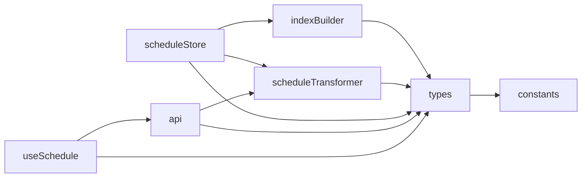

# Design Document: Schedule Feature - Phase 1

## Overview

This design document outlines the core infrastructure and data layer for the
Schedule Feature in the Maktab school timetable application. Phase 1 establishes
the foundational architecture for loading, normalizing, indexing, and querying
schedule data generated by the Python OR-Tools solver.

The design follows the existing feature module pattern established in
`packages/web/src/features/teachers/` and integrates with the existing API
layer, Zustand state management, and TanStack Query caching infrastructure.

## Architecture

```mermaid
graph TB
    subgraph "Frontend (packages/web)"
        subgraph "Schedule Feature Module"
            Types[types.ts]
            Constants[constants.ts]
            Store[stores/scheduleStore.ts]
            Hooks[hooks/useSchedule.ts]
            API[api.ts]

            subgraph "Utils"
                IndexBuilder[indexBuilder.ts]
                Transformer[scheduleTransformer.ts]
            end
        end

        subgraph "Shared"
            LibAPI[lib/api.ts]
            QueryClient[TanStack Query]
        end
    end

    subgraph "Backend (packages/api)"
        TimetableRoutes[/api/timetables]
        TimetableService[TimetableService]
        TimetableRepo[TimetableRepository]
        DB[(SQLite)]
    end

    subgraph "Solver (packages/solver)"
        SolverOutput[SolverOutput Model]
    end

    Hooks --> API
    API --> LibAPI
    LibAPI --> TimetableRoutes
    TimetableRoutes --> TimetableService
    TimetableService --> TimetableRepo
    TimetableRepo --> DB

    API --> Transformer
    Transformer --> Types
    Store --> IndexBuilder
    IndexBuilder --> Types
    Store --> Transformer

    SolverOutput -.->|"JSON structure"| Types
```

### Data Flow

1. **Fetch**: TanStack Query hook calls `scheduleApi.getById(id)`
2. **Transform**: `normalizeSchedule()` parses JSON data field and maps to typed
   interfaces
3. **Index**: `buildIndexes()` creates O(1) lookup maps for efficient queries
4. **Store**: Zustand store holds normalized data, indexes, and entity maps
5. **Query**: Components access data via store selectors or direct index lookups

## Components and Interfaces

### File Structure

```
packages/web/src/features/schedule/
├── __tests__/
│   ├── indexBuilder.test.ts
│   ├── indexBuilder.property.test.ts
│   ├── scheduleTransformer.test.ts
│   └── scheduleTransformer.property.test.ts
├── hooks/
│   └── useSchedule.ts
├── stores/
│   └── scheduleStore.ts
├── utils/
│   ├── indexBuilder.ts
│   ├── scheduleTransformer.ts
│   └── logger.ts
├── api.ts
├── constants.ts
├── types.ts
└── index.ts
```

### Module Dependencies



## Data Models

### Core Types (types.ts)

```typescript
/**
 * Day of week enum matching solver output
 * Afghan week starts on Saturday
 */
export enum DayOfWeek {
  Saturday = 'Saturday',
  Sunday = 'Sunday',
  Monday = 'Monday',
  Tuesday = 'Tuesday',
  Wednesday = 'Wednesday',
  Thursday = 'Thursday',
  Friday = 'Friday',
}

/**
 * A single scheduled lesson in the timetable
 * Maps directly to solver's ScheduledLesson model
 */
export interface ScheduledLesson {
  day: DayOfWeek;
  periodIndex: number;
  classId: string;
  className: string | null;
  subjectId: string;
  subjectName: string | null;
  teacherIds: string[];
  teacherNames: string[] | null;
  roomId: string | null;
  roomName: string | null;
  isFixed: boolean;
  periodsThisDay: number | null;
}

/**
 * Metadata about a class in the solution
 */
export interface ClassMetadata {
  classId: string;
  className: string;
  gradeLevel: number | null;
  category: string | null;
  categoryDari: string | null;
  studentCount: number;
  singleTeacherMode: boolean;
  classTeacherId: string | null;
  classTeacherName: string | null;
  classTeacherSubjects: string[] | null;
}

/**
 * Metadata about a subject in the solution
 */
export interface SubjectMetadata {
  subjectId: string;
  subjectName: string;
  isCustom: boolean;
  customCategory: string | null;
  customCategoryDari: string | null;
}

/**
 * Metadata about a teacher in the solution
 */
export interface TeacherMetadata {
  teacherId: string;
  teacherName: string;
  primarySubjects: string[];
  maxPeriodsPerWeek: number;
  classTeacherOf: string[];
}

/**
 * Metadata about a room (derived from lessons)
 */
export interface RoomMetadata {
  roomId: string;
  roomName: string;
}

/**
 * Period configuration from solver
 */
export interface PeriodConfiguration {
  periodsPerDayMap: Record<string, number>;
  totalPeriodsPerWeek: number;
  daysOfWeek: string[];
  hasVariablePeriods: boolean;
}

/**
 * Complete solution metadata
 */
export interface SolutionMetadata {
  classes: ClassMetadata[];
  subjects: SubjectMetadata[];
  teachers: TeacherMetadata[];
  periodConfiguration: PeriodConfiguration | null;
}

/**
 * Solution statistics from solver
 */
export interface SolutionStatistics {
  totalClasses: number;
  singleTeacherClasses: number;
  multiTeacherClasses: number;
  totalSubjects: number;
  customSubjects: number;
  standardSubjects: number;
  totalTeachers: number;
  totalRooms: number;
  categoryCounts: Record<string, number>;
  customSubjectsByCategory: Record<string, number>;
  totalLessons: number;
  periodsPerWeek: number;
  solveTimeSeconds: number | null;
  strategy: string | null;
  numConstraintsApplied: number | null;
  qualityScore: number | null;
}

/**
 * Pre-computed indexes for O(1) lookups
 */
export interface ScheduleIndexes {
  /** Lessons by slot key: "${day}-${periodIndex}" */
  bySlot: Map<string, ScheduledLesson[]>;
  /** Lessons by teacher+slot: "${teacherId}-${day}-${periodIndex}" */
  byTeacherAndSlot: Map<string, ScheduledLesson>;
  /** Lessons by room+slot: "${roomId}-${day}-${periodIndex}" */
  byRoomAndSlot: Map<string, ScheduledLesson>;
  /** Lessons by class+slot: "${classId}-${day}-${periodIndex}" */
  byClassAndSlot: Map<string, ScheduledLesson>;
  /** All lessons for a teacher: teacherId -> lessons[] */
  byTeacher: Map<string, ScheduledLesson[]>;
  /** All lessons for a class: classId -> lessons[] */
  byClass: Map<string, ScheduledLesson[]>;
  /** All lessons for a room: roomId -> lessons[] */
  byRoom: Map<string, ScheduledLesson[]>;
}

/**
 * Display settings for schedule rendering
 */
export interface DisplaySettings {
  showSubjectName: boolean;
  showTeacherName: boolean;
  showRoomName: boolean;
  cellSize: number;
  fontSize: number;
}

/**
 * Complete schedule state
 */
export interface ScheduleState {
  scheduleId: number | null;
  scheduleName: string;
  lessons: ScheduledLesson[];
  indexes: ScheduleIndexes;
  metadata: SolutionMetadata | null;
  statistics: SolutionStatistics | null;
  teachers: Map<string, TeacherMetadata>;
  rooms: Map<string, RoomMetadata>;
  classes: Map<string, ClassMetadata>;
  subjects: Map<string, SubjectMetadata>;
  displaySettings: DisplaySettings;
  isLoading: boolean;
  error: string | null;
}

/**
 * API response structure for timetable
 */
export interface TimetableApiResponse {
  id: number;
  name: string;
  description: string;
  data: string; // JSON string containing SolverOutput
  schoolId: number | null;
  academicYearId: number | null;
  termId: number | null;
  createdAt: string;
  updatedAt: string;
}

/**
 * Normalized schedule data after transformation
 */
export interface NormalizedSchedule {
  lessons: ScheduledLesson[];
  metadata: SolutionMetadata | null;
  statistics: SolutionStatistics | null;
}
```

### Index Key Formats

| Index            | Key Format                           | Example         |
| ---------------- | ------------------------------------ | --------------- |
| bySlot           | `${day}-${periodIndex}`              | `"Monday-2"`    |
| byTeacherAndSlot | `${teacherId}-${day}-${periodIndex}` | `"t1-Monday-2"` |
| byRoomAndSlot    | `${roomId}-${day}-${periodIndex}`    | `"r1-Monday-2"` |
| byClassAndSlot   | `${classId}-${day}-${periodIndex}`   | `"c1-Monday-2"` |
| byTeacher        | `${teacherId}`                       | `"t1"`          |
| byClass          | `${classId}`                         | `"c1"`          |
| byRoom           | `${roomId}`                          | `"r1"`          |

### Store Actions

```typescript
interface ScheduleActions {
  loadSchedule: (id: number) => Promise<void>;
  clearSchedule: () => void;
  updateIndexes: () => void;
  setDisplaySettings: (settings: Partial<DisplaySettings>) => void;
}
```

## Correctness Properties

_A property is a characteristic or behavior that should hold true across all
valid executions of a system-essentially, a formal statement about what the
system should do. Properties serve as the bridge between human-readable
specifications and machine-verifiable correctness guarantees._

Based on the acceptance criteria analysis, the following correctness properties
must be verified through property-based testing:

### Property 1: Index Builder Completeness

_For any_ array of ScheduledLesson objects, after calling buildIndexes, every
lesson in the input array SHALL be retrievable via:

- bySlot using key `${lesson.day}-${lesson.periodIndex}`
- byClassAndSlot using key
  `${lesson.classId}-${lesson.day}-${lesson.periodIndex}`
- byClass using key `${lesson.classId}`
- byTeacher for each teacherId in `lesson.teacherIds`
- byRoom using key `${lesson.roomId}` (when roomId is not null)

**Validates: Requirements 3.2, 3.3, 3.5**

### Property 2: Multi-Teacher Index Correctness

_For any_ ScheduledLesson with multiple teacherIds, the byTeacherAndSlot index
SHALL contain an entry for each teacher using key
`${teacherId}-${lesson.day}-${lesson.periodIndex}`, and each entry SHALL
reference the same lesson.

**Validates: Requirements 3.4**

### Property 3: Transformer Round-Trip Consistency

_For any_ valid NormalizedSchedule object, serializing it to JSON (as stored in
API response data field) and then calling normalizeSchedule SHALL produce an
equivalent NormalizedSchedule with:

- Same number of lessons with matching field values
- Equivalent metadata structure (classes, subjects, teachers,
  periodConfiguration)
- Equivalent statistics values

**Validates: Requirements 4.2, 4.3, 4.4, 4.5**

### Property 4: Store Clear Reset Invariant

_For any_ ScheduleState (regardless of current values), calling clearSchedule
SHALL result in a state where:

- scheduleId is null
- scheduleName is empty string
- lessons is empty array
- all index Maps are empty
- metadata is null
- statistics is null
- all entity Maps are empty
- displaySettings equals DEFAULT_DISPLAY_SETTINGS
- isLoading is false
- error is null

**Validates: Requirements 2.3**

### Property 5: Store Index Consistency

_For any_ ScheduleState with a non-empty lessons array, after calling
updateIndexes, the indexes SHALL be consistent with the lessons array such that:

- bySlot.size equals the number of unique (day, periodIndex) combinations
- byClass.size equals the number of unique classIds
- byTeacher.size equals the number of unique teacherIds across all lessons
- Every lesson is findable via its corresponding index keys

**Validates: Requirements 2.4**

## Error Handling

### Transformer Errors

| Error Condition                | Error Type               | Message Pattern                                |
| ------------------------------ | ------------------------ | ---------------------------------------------- |
| Malformed JSON in data field   | `ScheduleTransformError` | "Failed to parse schedule data: {parseError}"  |
| Missing required lesson fields | `ScheduleTransformError` | "Invalid lesson at index {i}: missing {field}" |
| Invalid day value              | `ScheduleTransformError` | "Invalid day value: {value}"                   |

### Store Errors

| Error Condition     | Handling                                    |
| ------------------- | ------------------------------------------- |
| API fetch failure   | Set `error` field, set `isLoading` to false |
| Transform failure   | Set `error` field, set `isLoading` to false |
| Index build failure | Set `error` field, keep existing data       |

### API Errors

| HTTP Status   | User Message (Farsi)                                  |
| ------------- | ----------------------------------------------------- |
| 404           | "جدول زمانی یافت نشد" (Schedule not found)            |
| 500           | "خطا در بارگذاری جدول زمانی" (Error loading schedule) |
| Network error | "خطا در اتصال به سرور" (Server connection error)      |

## Testing Strategy

### Dual Testing Approach

This feature uses both unit tests and property-based tests:

- **Unit tests**: Verify specific examples, edge cases, and error conditions
- **Property-based tests**: Verify universal properties that hold across all
  valid inputs

### Property-Based Testing Framework

- **Library**: fast-check (already used in the codebase)
- **Minimum iterations**: 100 per property test
- **Test file location**: `features/schedule/__tests__/*.property.test.ts`

### Test Categories

#### Unit Tests

1. **Index Builder**
   - Empty lessons array returns empty indexes
   - Single lesson indexed correctly
   - Lesson with null roomId not in byRoom index

2. **Transformer**
   - Valid API response transforms correctly
   - Malformed JSON throws descriptive error
   - Missing optional fields handled gracefully

3. **Store**
   - Initial state has correct structure
   - loadSchedule error handling
   - clearSchedule resets to initial state

4. **Constants**
   - DAYS_OF_WEEK has 7 entries with correct structure
   - GRADE_CATEGORIES has 4 categories
   - DEFAULT_DISPLAY_SETTINGS has correct values

#### Property-Based Tests

Each property test MUST:

1. Be tagged with format:
   `**Feature: schedule-phase1, Property {number}: {property_text}**`
2. Reference the requirements it validates
3. Run minimum 100 iterations
4. Use smart generators that produce valid ScheduledLesson objects

### Test Generators

```typescript
// Generator for valid DayOfWeek
const dayOfWeekArb = fc.constantFrom(...Object.values(DayOfWeek));

// Generator for valid ScheduledLesson
const scheduledLessonArb = fc.record({
  day: dayOfWeekArb,
  periodIndex: fc.integer({ min: 0, max: 7 }),
  classId: fc.string({ minLength: 1, maxLength: 10 }),
  className: fc.option(fc.string(), { nil: null }),
  subjectId: fc.string({ minLength: 1, maxLength: 10 }),
  subjectName: fc.option(fc.string(), { nil: null }),
  teacherIds: fc.array(fc.string({ minLength: 1, maxLength: 10 }), {
    minLength: 1,
    maxLength: 3,
  }),
  teacherNames: fc.option(fc.array(fc.string()), { nil: null }),
  roomId: fc.option(fc.string({ minLength: 1, maxLength: 10 }), { nil: null }),
  roomName: fc.option(fc.string(), { nil: null }),
  isFixed: fc.boolean(),
  periodsThisDay: fc.option(fc.integer({ min: 1, max: 8 }), { nil: null }),
});

// Generator for lessons array (0-100 lessons for performance)
const lessonsArrayArb = fc.array(scheduledLessonArb, {
  minLength: 0,
  maxLength: 100,
});
```

## Implementation Notes

### Performance Considerations

- Index building is O(n) where n = number of lessons
- Index lookups are O(1) using Map
- For 700+ lessons (typical large school), index build time should be < 50ms
- Use `Map` instead of plain objects for better performance with string keys

### Immer Middleware Usage

```typescript
import { create } from 'zustand';
import { immer } from 'zustand/middleware/immer';

export const useScheduleStore = create<ScheduleState & ScheduleActions>()(
  immer((set, get) => ({
    // ... state and actions
  }))
);
```

### API Integration

The schedule API follows the existing pattern in `lib/api.ts`:

```typescript
// In api.ts
export const scheduleApi = {
  getById: (id: number) => fetchApi<TimetableApiResponse>(`/timetables/${id}`),
  getAll: () => fetchApi<TimetableApiResponse[]>('/timetables'),
  save: (data: SaveScheduleInput) =>
    fetchApi<TimetableApiResponse>('/timetables', {
      method: 'POST',
      body: JSON.stringify(data),
    }),
  delete: (id: number) =>
    fetchApi<void>(`/timetables/${id}`, { method: 'DELETE' }),
};
```

### Query Key Strategy

```typescript
export const SCHEDULE_QUERY_KEYS = {
  all: ['schedules'] as const,
  lists: () => [...SCHEDULE_QUERY_KEYS.all, 'list'] as const,
  detail: (id: number) => ['schedule', id] as const,
};
```
