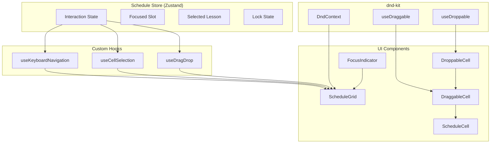
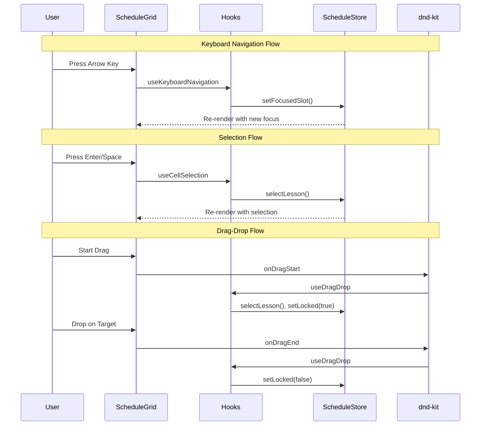

# Design Document: Schedule Feature - Phase 6: Manual Editing Foundation

## Overview

This design document describes the implementation of the manual editing
foundation for the schedule feature. Phase 6 establishes the interaction
patterns that enable users to navigate, select, and prepare lessons for editing
operations using both keyboard and mouse interactions.

The implementation extends the existing schedule store with interaction state
management and introduces new hooks and components for keyboard navigation, cell
selection, and drag-and-drop functionality using the dnd-kit library already
available in the project.

## Architecture

### High-Level Component Architecture



### Data Flow



## Components and Interfaces

### 1. Extended Schedule Store Interface

```typescript
// Interaction state types
type InteractionMode = 'idle' | 'selecting' | 'previewing' | 'executing';

interface FocusedSlot {
  day: DayOfWeek;
  period: number;
}

interface InteractionState {
  interactionMode: InteractionMode;
  focusedSlot: FocusedSlot | null;
  selectedLesson: ScheduledLesson | null;
  isLocked: boolean;
}

// Extended store actions
interface InteractionActions {
  setFocusedSlot: (slot: FocusedSlot | null) => void;
  selectLesson: (lesson: ScheduledLesson | null) => void;
  cancelSelection: () => void;
  setLocked: (locked: boolean) => void;
}
```

### 2. useKeyboardNavigation Hook

```typescript
interface UseKeyboardNavigationOptions {
  days: DayOfWeek[];
  periodsPerDay: number | Map<DayOfWeek, number>;
  gridRef: RefObject<HTMLElement>;
}

interface UseKeyboardNavigationReturn {
  handleKeyDown: (event: KeyboardEvent) => void;
}

function useKeyboardNavigation(
  options: UseKeyboardNavigationOptions
): UseKeyboardNavigationReturn;
```

### 3. useCellSelection Hook

```typescript
interface UseCellSelectionOptions {
  onSwapInitiated?: (source: ScheduledLesson, target: FocusedSlot) => void;
}

interface UseCellSelectionReturn {
  handleCellAction: (
    day: DayOfWeek,
    period: number,
    lesson: ScheduledLesson | null
  ) => void;
  handleEscape: () => void;
}

function useCellSelection(
  options?: UseCellSelectionOptions
): UseCellSelectionReturn;
```

### 4. useDragDrop Hook

```typescript
interface UseDragDropOptions {
  viewScope: 'class' | 'teacher';
  viewId: string;
}

interface UseDragDropReturn {
  sensors: SensorDescriptor<SensorOptions>[];
  handleDragStart: (event: DragStartEvent) => void;
  handleDragEnd: (event: DragEndEvent) => void;
  handleDragCancel: () => void;
}

function useDragDrop(options: UseDragDropOptions): UseDragDropReturn;
```

### 5. DraggableCell Component

```typescript
interface DraggableCellProps {
  id: string;
  day: DayOfWeek;
  period: number;
  lesson: ScheduledLesson | null;
  displaySettings: DisplaySettings;
  isSelected: boolean;
  isFocused: boolean;
  isHighlighted: boolean;
  validationStatus: CellValidationStatus;
  disabled: boolean;
}

function DraggableCell(props: DraggableCellProps): JSX.Element;
```

### 6. DroppableCell Component

```typescript
interface DroppableCellProps {
  id: string;
  day: DayOfWeek;
  period: number;
  children: React.ReactNode;
  disabled: boolean;
}

function DroppableCell(props: DroppableCellProps): JSX.Element;
```

### 7. FocusIndicator Component

```typescript
interface FocusIndicatorProps {
  slot: FocusedSlot | null;
  cellRefs: Map<string, HTMLElement>;
}

function FocusIndicator(props: FocusIndicatorProps): JSX.Element | null;
```

### 8. Updated ScheduleCell Props

```typescript
interface ScheduleCellProps {
  // Existing props
  lesson: ScheduledLesson | null;
  displaySettings: DisplaySettings;
  isSelected?: boolean;
  isFocused?: boolean;
  isHighlighted?: boolean;
  validationStatus?: CellValidationStatus;
  onClick?: () => void;
  isReadOnly?: boolean;

  // New props for Phase 6
  isDragging?: boolean;
  isDropTarget?: boolean;
}
```

## Data Models

### Interaction State Model

```typescript
interface InteractionState {
  /**
   * Current interaction mode
   * - idle: No active interaction
   * - selecting: User has selected a lesson
   * - previewing: Showing preview of potential swap (Phase 7)
   * - executing: Swap operation in progress (Phase 7)
   */
  interactionMode: InteractionMode;

  /**
   * Currently focused slot (keyboard navigation)
   * null when grid is not focused
   */
  focusedSlot: FocusedSlot | null;

  /**
   * Currently selected lesson for editing
   * null when no lesson is selected
   */
  selectedLesson: ScheduledLesson | null;

  /**
   * Lock flag to prevent concurrent interactions
   * true during drag operations
   */
  isLocked: boolean;
}
```

### Drag Data Model

```typescript
interface DragData {
  type: 'lesson';
  lesson: ScheduledLesson;
  sourceSlot: FocusedSlot;
  viewScope: 'class' | 'teacher';
  viewId: string;
}
```

### Cell Identifier

```typescript
// Cell ID format: "${day}-${period}"
type CellId = string;

function createCellId(day: DayOfWeek, period: number): CellId {
  return `${day}-${period}`;
}

function parseCellId(id: CellId): FocusedSlot {
  const [day, periodStr] = id.split('-');
  return { day: day as DayOfWeek, period: parseInt(periodStr, 10) };
}
```

## Correctness Properties

_A property is a characteristic or behavior that should hold true across all
valid executions of a system-essentially, a formal statement about what the
system should do. Properties serve as the bridge between human-readable
specifications and machine-verifiable correctness guarantees._

Based on the prework analysis, the following correctness properties have been
identified:

### Property 1: Keyboard Navigation Correctness

_For any_ focused slot and arrow key press, the navigation function should
return the correct new slot according to RTL rules:

- ArrowUp: same day, period - 1 (clamped to 0)
- ArrowDown: same day, period + 1 (clamped to max)
- ArrowLeft: next day in array (clamped to last)
- ArrowRight: previous day in array (clamped to first)

**Validates: Requirements 1.1, 1.2, 1.3, 1.4, 1.5**

### Property 2: Navigation Lock Enforcement

_For any_ navigation input while isLocked is true, the focused slot should
remain unchanged.

**Validates: Requirements 1.6**

### Property 3: Focus Indicator Uniqueness

_For any_ schedule state where focusedSlot is non-null, exactly one cell should
have the isFocused property set to true, and it should correspond to the
focusedSlot coordinates.

**Validates: Requirements 2.1, 2.2**

### Property 4: Selection State Consistency

_For any_ selection action (Enter/Space on focused cell or click on cell with
lesson), the selectedLesson should be set to the lesson at that position, and
interactionMode should be 'selecting'.

**Validates: Requirements 3.1, 3.2, 3.5**

### Property 5: Escape Cancellation

_For any_ state with a non-null selectedLesson, pressing Escape should result in
selectedLesson being null and interactionMode being 'idle'.

**Validates: Requirements 3.3**

### Property 6: Drag Lock State Management

_For any_ drag operation:

- onDragStart should set isLocked to true and selectedLesson to the dragged
  lesson
- onDragEnd should set isLocked to false
- onDragCancel should set isLocked to false, selectedLesson to null, and
  interactionMode to 'idle'

**Validates: Requirements 4.1, 4.2, 4.5, 4.6**

### Property 7: Drop Target Validation

_For any_ drop attempt, the drop should only be accepted if the source and
target are within the same view scope (same class view or same teacher view).

**Validates: Requirements 5.1, 5.4**

### Property 8: Initial Focus Behavior

_For any_ grid focus event where focusedSlot is null, the focusedSlot should be
set to the first cell (first day, period 0).

**Validates: Requirements 6.2**

### Property 9: Visual State Composition

_For any_ combination of cell states (isFocused, isSelected, isDragging,
isDropTarget), the cell should have all corresponding CSS classes applied
without conflicts.

**Validates: Requirements 7.1, 7.2, 7.3, 7.4, 7.5**

### Property 10: Store State Type Invariants

_For any_ store state:

- interactionMode is one of: 'idle', 'selecting', 'previewing', 'executing'
- focusedSlot is either null or has valid day (DayOfWeek) and period
  (non-negative integer)
- selectedLesson is either null or a valid ScheduledLesson
- isLocked is a boolean

**Validates: Requirements 8.1, 8.2, 8.3, 8.4**

## Error Handling

### Keyboard Navigation Errors

| Error Condition            | Handling Strategy              |
| -------------------------- | ------------------------------ |
| Grid not focused           | Ignore keyboard events         |
| Invalid key pressed        | Ignore, no state change        |
| Navigation while locked    | Ignore, maintain current focus |
| Focus on non-existent cell | Clamp to valid boundaries      |

### Drag-Drop Errors

| Error Condition         | Handling Strategy             |
| ----------------------- | ----------------------------- |
| Drag empty cell         | Prevent drag start            |
| Drop on invalid target  | Cancel operation, reset state |
| Drop outside grid       | Cancel operation, reset state |
| Concurrent drag attempt | Block (isLocked prevents)     |

### Selection Errors

| Error Condition          | Handling Strategy            |
| ------------------------ | ---------------------------- |
| Select empty cell        | No selection change          |
| Select while locked      | Ignore selection attempt     |
| Invalid lesson reference | Clear selection, log warning |

## Testing Strategy

### Property-Based Testing

The implementation will use **fast-check** (already available in the project)
for property-based testing. Each correctness property will be implemented as a
property-based test.

**Configuration:**

- Minimum 100 iterations per property test
- Custom generators for:
  - `DayOfWeek` values
  - `FocusedSlot` with valid day/period combinations
  - `ScheduledLesson` instances
  - `InteractionState` with valid mode/slot/lesson combinations

**Test File Location:** `packages/web/src/features/schedule/__tests__/`

**Property Test Annotation Format:**

```typescript
// **Feature: schedule-phase6, Property 1: Keyboard Navigation Correctness**
// **Validates: Requirements 1.1, 1.2, 1.3, 1.4, 1.5**
```

### Unit Tests

Unit tests will cover:

- Hook initialization and cleanup
- Component rendering with various prop combinations
- Store action behavior
- Edge cases identified in prework (boundary navigation, empty cells)

### Integration Tests

Integration tests will verify:

- Keyboard navigation flow end-to-end
- Drag-drop flow with dnd-kit
- State synchronization between hooks and store

### Test Organization

```
__tests__/
├── interactionStore.property.test.ts    # Property 10
├── keyboardNavigation.property.test.ts  # Properties 1, 2
├── cellSelection.property.test.ts       # Properties 4, 5
├── dragDrop.property.test.ts            # Properties 6, 7
├── focusIndicator.property.test.ts      # Property 3
├── visualStates.property.test.ts        # Property 9
├── initialFocus.property.test.ts        # Property 8
├── useKeyboardNavigation.test.ts        # Unit tests
├── useCellSelection.test.ts             # Unit tests
├── useDragDrop.test.ts                  # Unit tests
└── DraggableCell.test.tsx               # Component tests
```
