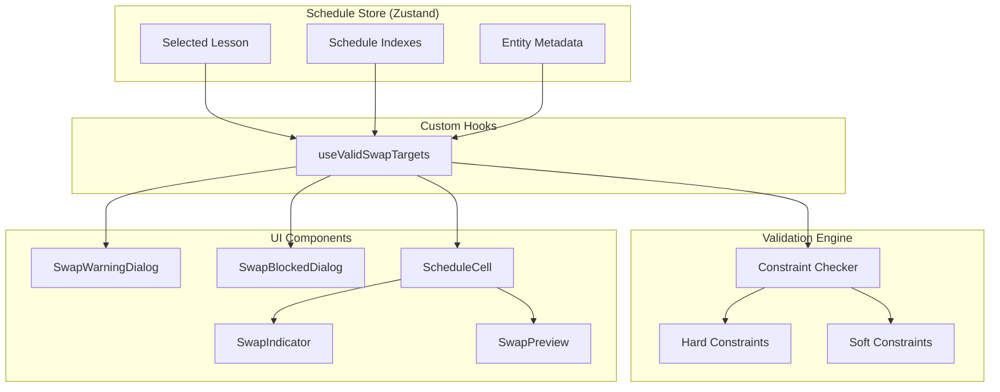
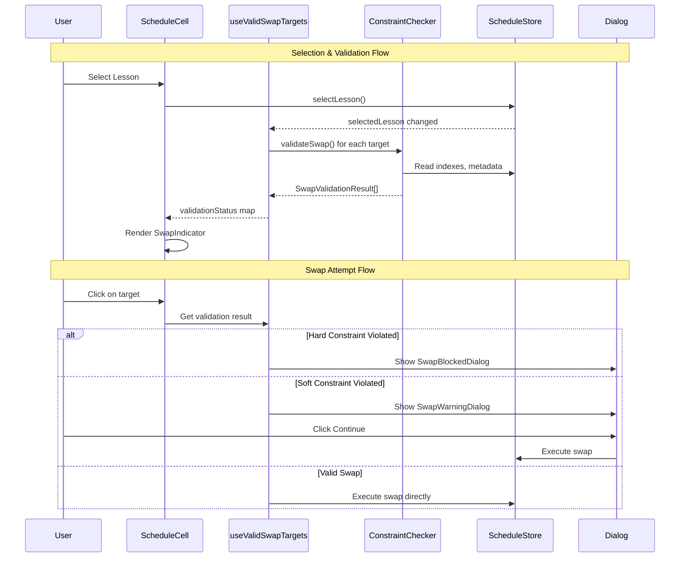

# Design Document: Schedule Feature - Phase 7: Swap Validation Engine

## Overview

This design document describes the implementation of the Swap Validation Engine
for the schedule feature. Phase 7 implements the core complexity of manual
schedule editing by computing which lessons can be swapped with a selected
lesson, checking all hard and soft constraints in real-time.

The validation engine provides:

- Real-time constraint checking for swap operations
- Visual feedback showing valid, warning, and blocked swap targets
- Dialogs explaining constraint violations to users
- Performance-optimized validation using pre-computed indexes

## Architecture

### High-Level Component Architecture



### Data Flow



## Components and Interfaces

### 1. Constraint Types (features/schedule/constants.ts)

```typescript
/**
 * Constraint type definitions for swap validation
 * Hard constraints block swaps, soft constraints generate warnings
 */
export const SWAP_CONSTRAINT_TYPES = {
  // Hard constraints (block swap)
  TEACHER_UNAVAILABLE: {
    severity: 'hard' as const,
    code: 'teacher_unavailable',
    messageFa: 'معلم در این زمان در دسترس نیست',
  },
  TEACHER_CONFLICT: {
    severity: 'hard' as const,
    code: 'teacher_conflict',
    messageFa: 'معلم در این زمان کلاس دیگری دارد',
  },
  ROOM_CONFLICT: {
    severity: 'hard' as const,
    code: 'room_conflict',
    messageFa: 'اتاق در این زمان اشغال است',
  },
  CLASS_CONFLICT: {
    severity: 'hard' as const,
    code: 'class_conflict',
    messageFa: 'کلاس در این زمان درس دیگری دارد',
  },
  ROOM_TYPE_MISMATCH: {
    severity: 'hard' as const,
    code: 'room_type_mismatch',
    messageFa: 'نوع اتاق با نیاز درس مطابقت ندارد',
  },

  // Soft constraints (warning)
  TEACHER_PREFERENCE: {
    severity: 'soft' as const,
    code: 'teacher_preference',
    messageFa: 'این زمان با ترجیح معلم مطابقت ندارد',
  },
  CONSECUTIVE_EXCEEDED: {
    severity: 'soft' as const,
    code: 'consecutive_exceeded',
    messageFa: 'تعداد ساعات متوالی معلم بیش از حد مجاز می‌شود',
  },
  DIFFICULT_AFTERNOON: {
    severity: 'soft' as const,
    code: 'difficult_afternoon',
    messageFa: 'درس سخت در بعدازظهر توصیه نمی‌شود',
  },
} as const;

export type SwapConstraintType = keyof typeof SWAP_CONSTRAINT_TYPES;
export type ConstraintSeverity = 'hard' | 'soft';
```

### 2. Constraint Checker Types (features/schedule/types.ts)

```typescript
/**
 * Represents a swap operation between two lessons
 */
export interface SwapOperation {
  lessonA: ScheduledLesson;
  lessonB: ScheduledLesson | null; // null for empty slot
  slotA: { day: DayOfWeek; period: number };
  slotB: { day: DayOfWeek; period: number };
}

/**
 * A single constraint violation
 */
export interface ConstraintViolation {
  type: SwapConstraintType;
  severity: ConstraintSeverity;
  message: string; // Persian message
  details: Record<string, unknown>;
}

/**
 * Result of validating a swap operation
 */
export interface SwapValidationResult {
  isValid: boolean;
  canProceedWithWarning: boolean;
  errors: ConstraintViolation[]; // Hard violations
  warnings: ConstraintViolation[]; // Soft violations
  swap: SwapOperation;
}

/**
 * Teacher data needed for constraint checking
 */
export interface TeacherConstraintData {
  id: string;
  availability: Record<DayOfWeek, boolean[]>;
  timePreference?: 'Morning' | 'Afternoon' | 'None';
  maxConsecutivePeriods?: number;
}

/**
 * Subject data needed for constraint checking
 */
export interface SubjectConstraintData {
  id: string;
  requiredRoomType?: string | null;
  isDifficult?: boolean;
}

/**
 * Room data needed for constraint checking
 */
export interface RoomConstraintData {
  id: string;
  type: string;
}
```

### 3. Constraint Checker Functions (features/schedule/utils/constraintChecker.ts)

```typescript
/**
 * Main validation function for swap operations
 */
export function validateSwap(
  swap: SwapOperation,
  indexes: ScheduleIndexes,
  teachers: Map<string, TeacherConstraintData>,
  rooms: Map<string, RoomConstraintData>,
  subjects: Map<string, SubjectConstraintData>
): SwapValidationResult;

/**
 * Individual constraint check functions
 * Each returns a violation or null if constraint is satisfied
 */
export function checkTeacherAvailability(
  lesson: ScheduledLesson,
  targetSlot: { day: DayOfWeek; period: number },
  teachers: Map<string, TeacherConstraintData>
): ConstraintViolation | null;

export function checkTeacherConflict(
  lesson: ScheduledLesson,
  targetSlot: { day: DayOfWeek; period: number },
  indexes: ScheduleIndexes,
  excludeLessonId?: string
): ConstraintViolation | null;

export function checkRoomConflict(
  lesson: ScheduledLesson,
  targetSlot: { day: DayOfWeek; period: number },
  indexes: ScheduleIndexes,
  excludeLessonId?: string
): ConstraintViolation | null;

export function checkClassConflict(
  lesson: ScheduledLesson,
  targetSlot: { day: DayOfWeek; period: number },
  indexes: ScheduleIndexes,
  excludeLessonId?: string
): ConstraintViolation | null;

export function checkRoomTypeMismatch(
  lesson: ScheduledLesson,
  targetRoom: RoomConstraintData | null,
  subjects: Map<string, SubjectConstraintData>
): ConstraintViolation | null;

export function checkTeacherPreference(
  lesson: ScheduledLesson,
  targetSlot: { day: DayOfWeek; period: number },
  teachers: Map<string, TeacherConstraintData>
): ConstraintViolation | null;

export function checkConsecutivePeriods(
  lesson: ScheduledLesson,
  targetSlot: { day: DayOfWeek; period: number },
  indexes: ScheduleIndexes,
  teachers: Map<string, TeacherConstraintData>
): ConstraintViolation | null;

export function checkDifficultAfternoon(
  lesson: ScheduledLesson,
  targetSlot: { day: DayOfWeek; period: number },
  subjects: Map<string, SubjectConstraintData>
): ConstraintViolation | null;
```

### 4. useValidSwapTargets Hook

```typescript
interface UseValidSwapTargetsOptions {
  viewScope: 'class' | 'teacher';
  scopeId: string;
}

interface UseValidSwapTargetsReturn {
  /** Map of slot key to validation result */
  validationResults: Map<string, SwapValidationResult>;
  /** Get validation status for a specific slot */
  getValidationStatus: (day: DayOfWeek, period: number) => CellValidationStatus;
  /** Check if any valid targets exist */
  hasValidTargets: boolean;
}

function useValidSwapTargets(
  selectedLesson: ScheduledLesson | null,
  options: UseValidSwapTargetsOptions
): UseValidSwapTargetsReturn;
```

### 5. SwapIndicator Component

```typescript
interface SwapIndicatorProps {
  status: CellValidationStatus; // 'valid' | 'warning' | 'blocked' | null
}

/**
 * Overlay component showing validation status on cells
 * - Valid: green overlay (bg-green-500/20, border-green-500)
 * - Warning: yellow overlay (bg-yellow-500/20, border-yellow-500)
 * - Blocked: red overlay (bg-red-500/20, border-red-500)
 * - null: no overlay
 */
function SwapIndicator(props: SwapIndicatorProps): JSX.Element | null;
```

### 6. SwapPreview Component

```typescript
interface SwapPreviewProps {
  sourceLesson: ScheduledLesson;
  targetLesson: ScheduledLesson | null;
  sourceSlot: { day: DayOfWeek; period: number };
  targetSlot: { day: DayOfWeek; period: number };
  displaySettings: DisplaySettings;
}

/**
 * Ghost preview showing swap result
 * Displays source lesson at target position and vice versa with reduced opacity
 */
function SwapPreview(props: SwapPreviewProps): JSX.Element;
```

### 7. SwapWarningDialog Component

```typescript
interface SwapWarningDialogProps {
  open: boolean;
  onOpenChange: (open: boolean) => void;
  warnings: ConstraintViolation[];
  onConfirm: () => void;
  onCancel: () => void;
}

/**
 * Dialog for soft constraint violations
 * Title: "هشدار جابجایی" (Swap Warning)
 * Buttons: "ادامه" (Continue), "لغو" (Cancel)
 */
function SwapWarningDialog(props: SwapWarningDialogProps): JSX.Element;
```

### 8. SwapBlockedDialog Component

```typescript
interface SwapBlockedDialogProps {
  open: boolean;
  onOpenChange: (open: boolean) => void;
  errors: ConstraintViolation[];
  alternativeSlots?: { day: DayOfWeek; period: number }[];
}

/**
 * Dialog for hard constraint violations
 * Title: "جابجایی ممکن نیست" (Swap Not Possible)
 * Button: "متوجه شدم" (Understood)
 */
function SwapBlockedDialog(props: SwapBlockedDialogProps): JSX.Element;
```

### 9. Updated ScheduleCell Props

```typescript
interface ScheduleCellProps {
  // Existing props from Phase 6
  lesson: ScheduledLesson | null;
  displaySettings: DisplaySettings;
  isSelected?: boolean;
  isFocused?: boolean;
  isHighlighted?: boolean;
  onClick?: () => void;
  isReadOnly?: boolean;
  isDragging?: boolean;
  isDropTarget?: boolean;

  // New props for Phase 7
  validationStatus?: CellValidationStatus;
  onSwapAttempt?: (targetSlot: { day: DayOfWeek; period: number }) => void;
}
```

## Data Models

### Constraint Violation Model

```typescript
interface ConstraintViolation {
  /** Constraint type from SWAP_CONSTRAINT_TYPES */
  type: SwapConstraintType;

  /** Severity: 'hard' blocks swap, 'soft' shows warning */
  severity: ConstraintSeverity;

  /** Persian message for display */
  message: string;

  /** Additional context for the violation */
  details: {
    // For TEACHER_CONFLICT
    conflictingClassName?: string;
    conflictingSubjectName?: string;

    // For ROOM_CONFLICT
    conflictingClassName?: string;

    // For ROOM_TYPE_MISMATCH
    requiredRoomType?: string;
    actualRoomType?: string;

    // For CONSECUTIVE_EXCEEDED
    currentConsecutive?: number;
    maxAllowed?: number;

    // For DIFFICULT_AFTERNOON
    subjectName?: string;

    // For TEACHER_PREFERENCE
    teacherPreference?: string;
    targetTimeOfDay?: string;
  };
}
```

### Swap Validation Result Model

```typescript
interface SwapValidationResult {
  /** True if no hard constraints violated */
  isValid: boolean;

  /** True if valid but has soft constraint warnings */
  canProceedWithWarning: boolean;

  /** Hard constraint violations (block swap) */
  errors: ConstraintViolation[];

  /** Soft constraint violations (show warning) */
  warnings: ConstraintViolation[];

  /** The swap operation being validated */
  swap: SwapOperation;
}
```

## Correctness Properties

_A property is a characteristic or behavior that should hold true across all
valid executions of a system-essentially, a formal statement about what the
system should do. Properties serve as the bridge between human-readable
specifications and machine-verifiable correctness guarantees._

Based on the prework analysis, the following correctness properties have been
identified:

### Property 1: Validation Result Correctness

_For any_ swap operation, the validation result flags must correctly reflect the
presence of violations:

- If any hard constraint is violated, isValid must be false
- If only soft constraints are violated, isValid must be true and
  canProceedWithWarning must be true
- If no constraints are violated, isValid must be true and canProceedWithWarning
  must be false

**Validates: Requirements 2.3, 2.4, 2.5**

### Property 2: Violation Categorization

_For any_ swap operation, all hard constraint violations must appear in the
errors array and all soft constraint violations must appear in the warnings
array.

**Validates: Requirements 2.6, 2.7**

### Property 3: Teacher Availability Check

_For any_ swap operation where the teacher's availability array shows false for
the target day and period, the validation must return a TEACHER_UNAVAILABLE
violation.

**Validates: Requirements 3.2**

### Property 4: Teacher Conflict Detection

_For any_ swap operation where a teacher is already scheduled at the target slot
(excluding the swap partner), the validation must return a TEACHER_CONFLICT
violation.

**Validates: Requirements 4.2**

### Property 5: Room Conflict Detection

_For any_ swap operation where the room is already occupied at the target slot
(excluding the swap partner), the validation must return a ROOM_CONFLICT
violation.

**Validates: Requirements 5.2**

### Property 6: Room Type Validation

_For any_ swap operation where the subject requires a specific room type and the
target room doesn't match, the validation must return a ROOM_TYPE_MISMATCH
violation.

**Validates: Requirements 6.2**

### Property 7: Class Conflict Detection

_For any_ swap operation where the class already has a lesson at the target slot
(excluding the swap partner), the validation must return a CLASS_CONFLICT
violation.

**Validates: Requirements 7.2**

### Property 8: Teacher Preference Violation

_For any_ swap operation where a teacher has a Morning preference and the target
slot is in the afternoon (period >= 4), or has an Afternoon preference and the
target slot is in the morning (period < 4), the validation must return a
TEACHER_PREFERENCE warning.

**Validates: Requirements 8.2, 8.3**

### Property 9: Consecutive Periods Warning

_For any_ swap operation where the resulting consecutive periods for a teacher
would exceed their maxConsecutivePeriods, the validation must return a
CONSECUTIVE_EXCEEDED warning.

**Validates: Requirements 9.2**

### Property 10: Difficult Subject Afternoon Warning

_For any_ swap operation where a difficult subject is moved to an afternoon slot
(period >= 4), the validation must return a DIFFICULT_AFTERNOON warning.

**Validates: Requirements 10.1**

### Property 11: Valid Targets Computation

_For any_ selected lesson, the useValidSwapTargets hook must:

- Return an empty map when no lesson is selected
- Exclude the selected lesson's own slot from potential targets
- Include validation results for all other slots in the view scope

**Validates: Requirements 11.1, 11.3, 11.4**

### Property 12: SwapIndicator Visual State

_For any_ validation status, the SwapIndicator must apply the correct CSS
classes:

- 'valid' → green overlay classes
- 'warning' → yellow overlay classes
- 'blocked' → red overlay classes
- null → no overlay rendered

**Validates: Requirements 12.1, 12.2, 12.3, 12.4**

### Property 13: Warning Dialog Display

_For any_ swap attempt with soft constraint violations, the SwapWarningDialog
must display and list all warnings.

**Validates: Requirements 14.1, 14.3**

### Property 14: Blocked Dialog Display

_For any_ swap attempt with hard constraint violations, the SwapBlockedDialog
must display and list all errors.

**Validates: Requirements 15.1, 15.3**

### Property 15: ScheduleCell Indicator Rendering

_For any_ validationStatus prop value, the ScheduleCell must render the
SwapIndicator with the correct status.

**Validates: Requirements 16.2**

### Property 16: Multi-Teacher Validation

_For any_ lesson with multiple teachers, all teachers must be checked for
availability and conflicts, and if ANY teacher has a violation, the result must
reflect it.

**Validates: Requirements 3.4, 18.1, 18.2, 18.3**

## Error Handling

### Constraint Check Errors

| Error Condition          | Handling Strategy                         |
| ------------------------ | ----------------------------------------- |
| Missing teacher data     | Skip teacher-specific checks, log warning |
| Missing room data        | Skip room-specific checks, log warning    |
| Missing subject data     | Skip subject-specific checks, log warning |
| Invalid slot coordinates | Return blocked result with generic error  |
| Index lookup failure     | Return blocked result, log error          |

### Hook Errors

| Error Condition       | Handling Strategy                        |
| --------------------- | ---------------------------------------- |
| Store not initialized | Return empty validation map              |
| Invalid view scope    | Return empty validation map, log warning |
| Computation timeout   | Return partial results, log warning      |

### Dialog Errors

| Error Condition           | Handling Strategy            |
| ------------------------- | ---------------------------- |
| Empty violations array    | Don't show dialog            |
| Missing violation message | Use fallback generic message |

## Testing Strategy

### Property-Based Testing

The implementation will use **fast-check** for property-based testing. Each
correctness property will be implemented as a property-based test.

**Configuration:**

- Minimum 100 iterations per property test
- Custom generators for:
  - `ScheduledLesson` with valid structure
  - `SwapOperation` with valid source/target slots
  - `TeacherConstraintData` with availability arrays
  - `SubjectConstraintData` with room requirements
  - `ScheduleIndexes` with consistent data

**Test File Location:** `packages/web/src/features/schedule/__tests__/`

**Property Test Annotation Format:**

```typescript
// **Feature: schedule-phase7, Property 1: Validation Result Correctness**
// **Validates: Requirements 2.3, 2.4, 2.5**
```

### Unit Tests

Unit tests will cover:

- Individual constraint checker functions
- Edge cases (empty slots, null rooms, missing data)
- Persian message content verification
- Violation details structure

### Integration Tests

Integration tests will verify:

- useValidSwapTargets hook with real store data
- Dialog display based on validation results
- ScheduleCell rendering with validation status

### Test Organization

```
__tests__/
├── constraintChecker.property.test.ts    # Properties 1-10, 16
├── constraintChecker.test.ts             # Unit tests for checkers
├── useValidSwapTargets.property.test.ts  # Property 11
├── useValidSwapTargets.test.ts           # Unit tests for hook
├── SwapIndicator.property.test.tsx       # Property 12
├── SwapIndicator.test.tsx                # Component tests
├── SwapWarningDialog.property.test.tsx   # Property 13
├── SwapWarningDialog.test.tsx            # Component tests
├── SwapBlockedDialog.property.test.tsx   # Property 14
├── SwapBlockedDialog.test.tsx            # Component tests
├── ScheduleCell.swap.property.test.tsx   # Property 15
└── ScheduleCell.swap.test.tsx            # Component tests
```

### Performance Testing

Performance tests will verify:

- Single swap validation < 1ms
- Full target computation < 100ms for 700 lessons
- Memoization effectiveness during selection session
