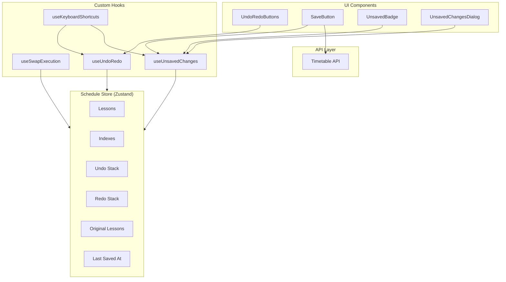
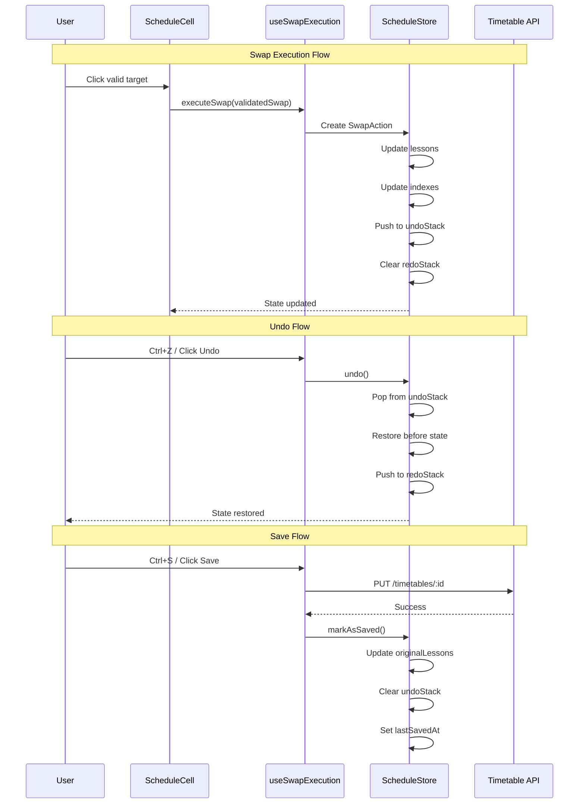

# Design Document: Schedule Feature - Phase 8: Undo/Redo & Persistence

## Overview

This design document describes the implementation of the Undo/Redo & Persistence
functionality for the schedule feature. Phase 8 builds on the swap validation
engine from Phase 7 to implement actual swap execution, undo/redo functionality,
and persistence to the database.

The implementation provides:

- Swap execution that creates reversible actions
- Undo/redo stacks with 50-action limit
- Keyboard shortcuts (Ctrl+Z, Ctrl+Y, Ctrl+S)
- Unsaved changes tracking and warnings
- Database persistence via timetable API

## Architecture

### High-Level Component Architecture



### Data Flow



## Components and Interfaces

### 1. Edit State Types (features/schedule/types.ts)

```typescript
/**
 * Represents a recorded swap action for undo/redo
 */
export interface SwapAction {
  /** Unique identifier for this action */
  id: string;
  /** Timestamp when action was executed */
  timestamp: number;
  /** Action type - always 'swap' for now */
  type: 'swap';
  /** State before the swap */
  before: {
    lessonA: ScheduledLesson;
    lessonB: ScheduledLesson | null;
  };
  /** State after the swap */
  after: {
    lessonA: ScheduledLesson;
    lessonB: ScheduledLesson | null;
  };
}

/**
 * Edit state for tracking changes
 */
export interface EditState {
  /** Snapshot of lessons from last save */
  originalLessons: ScheduledLesson[];
  /** Stack of actions that can be undone */
  undoStack: SwapAction[];
  /** Stack of actions that can be redone */
  redoStack: SwapAction[];
  /** Timestamp of last save, null if never saved */
  lastSavedAt: Date | null;
}

/**
 * Maximum number of actions in undo stack
 */
export const UNDO_STACK_LIMIT = 50;
```

### 2. Extended Schedule Store Actions

```typescript
interface ScheduleEditActions {
  /**
   * Executes a validated swap operation
   * Creates SwapAction, updates lessons/indexes, pushes to undoStack
   */
  executeSwap: (swap: SwapOperation) => void;

  /**
   * Undoes the last swap action
   * Pops from undoStack, restores before state, pushes to redoStack
   */
  undo: () => void;

  /**
   * Redoes the last undone action
   * Pops from redoStack, restores after state, pushes to undoStack
   */
  redo: () => void;

  /**
   * Marks current state as saved
   * Updates originalLessons, clears undoStack, sets lastSavedAt
   */
  markAsSaved: () => void;

  /**
   * Initializes edit state when schedule is loaded
   */
  initializeEditState: () => void;
}

interface ScheduleEditComputedState {
  /** Number of unsaved changes (undoStack length) */
  unsavedChangesCount: number;
  /** Whether there are unsaved changes */
  hasUnsavedChanges: boolean;
  /** Whether undo is available */
  canUndo: boolean;
  /** Whether redo is available */
  canRedo: boolean;
}
```

### 3. useSwapExecution Hook

```typescript
interface UseSwapExecutionReturn {
  /** Execute a validated swap */
  executeSwap: (validatedSwap: SwapValidationResult) => void;
  /** Whether a swap is currently being executed */
  isExecuting: boolean;
}

/**
 * Hook for executing validated swaps
 * Handles the transition from validation to execution
 */
function useSwapExecution(): UseSwapExecutionReturn;
```

### 4. useUndoRedo Hook

```typescript
interface UseUndoRedoReturn {
  /** Undo the last action */
  undo: () => void;
  /** Redo the last undone action */
  redo: () => void;
  /** Whether undo is available */
  canUndo: boolean;
  /** Whether redo is available */
  canRedo: boolean;
  /** Number of actions in undo stack */
  undoCount: number;
  /** Number of actions in redo stack */
  redoCount: number;
}

/**
 * Hook for undo/redo operations
 */
function useUndoRedo(): UseUndoRedoReturn;
```

### 5. useUnsavedChanges Hook

```typescript
interface UseUnsavedChangesReturn {
  /** Number of unsaved changes */
  count: number;
  /** Whether there are unsaved changes */
  hasChanges: boolean;
  /** Confirm leaving with unsaved changes */
  confirmLeave: () => Promise<boolean>;
  /** Save current changes */
  save: () => Promise<void>;
  /** Whether save is in progress */
  isSaving: boolean;
}

/**
 * Hook for tracking unsaved changes and handling navigation warnings
 */
function useUnsavedChanges(): UseUnsavedChangesReturn;
```

### 6. useKeyboardShortcuts Hook

```typescript
interface UseKeyboardShortcutsOptions {
  /** Whether shortcuts are enabled */
  enabled: boolean;
}

/**
 * Hook for registering keyboard shortcuts
 * Ctrl+Z: undo, Ctrl+Y/Ctrl+Shift+Z: redo, Ctrl+S: save
 */
function useKeyboardShortcuts(options: UseKeyboardShortcutsOptions): void;
```

### 7. UndoRedoButtons Component

```typescript
interface UndoRedoButtonsProps {
  /** Additional CSS classes */
  className?: string;
}

/**
 * Undo and redo buttons with tooltips and keyboard hints
 * Buttons are disabled when respective stacks are empty
 */
function UndoRedoButtons(props: UndoRedoButtonsProps): JSX.Element;
```

### 8. SaveButton Component

```typescript
interface SaveButtonProps {
  /** Additional CSS classes */
  className?: string;
}

/**
 * Save button with unsaved badge and loading state
 * Disabled when no unsaved changes
 */
function SaveButton(props: SaveButtonProps): JSX.Element;
```

### 9. UnsavedBadge Component

```typescript
interface UnsavedBadgeProps {
  /** Number of unsaved changes */
  count: number;
  /** Additional CSS classes */
  className?: string;
}

/**
 * Small badge showing unsaved changes count
 * Hidden when count is 0, animates on increment
 */
function UnsavedBadge(props: UnsavedBadgeProps): JSX.Element | null;
```

### 10. UnsavedChangesDialog Component

```typescript
interface UnsavedChangesDialogProps {
  /** Whether dialog is open */
  open: boolean;
  /** Callback when open state changes */
  onOpenChange: (open: boolean) => void;
  /** Number of unsaved changes */
  count: number;
  /** Callback for save and leave */
  onSaveAndLeave: () => void;
  /** Callback for leave without saving */
  onLeaveWithoutSaving: () => void;
  /** Callback for cancel */
  onCancel: () => void;
  /** Whether save is in progress */
  isSaving?: boolean;
}

/**
 * Dialog warning about unsaved changes
 * Shows count and provides save/leave/cancel options
 */
function UnsavedChangesDialog(props: UnsavedChangesDialogProps): JSX.Element;
```

## Data Models

### SwapAction Model

```typescript
interface SwapAction {
  /** Unique identifier (UUID) */
  id: string;

  /** Unix timestamp in milliseconds */
  timestamp: number;

  /** Action type */
  type: 'swap';

  /** State before swap */
  before: {
    /** First lesson in swap (always exists) */
    lessonA: ScheduledLesson;
    /** Second lesson in swap (null for empty slot) */
    lessonB: ScheduledLesson | null;
  };

  /** State after swap */
  after: {
    /** First lesson after swap (at lessonB's original position) */
    lessonA: ScheduledLesson;
    /** Second lesson after swap (at lessonA's original position, null if was empty) */
    lessonB: ScheduledLesson | null;
  };
}
```

### Extended ScheduleState

```typescript
interface ScheduleState {
  // ... existing state from Phase 6/7

  // Edit state (Phase 8)
  /** Snapshot of lessons from last save */
  originalLessons: ScheduledLesson[];
  /** Stack of undoable actions */
  undoStack: SwapAction[];
  /** Stack of redoable actions */
  redoStack: SwapAction[];
  /** Timestamp of last save */
  lastSavedAt: Date | null;
}
```

## Correctness Properties

_A property is a characteristic or behavior that should hold true across all
valid executions of a system-essentially, a formal statement about what the
system should do. Properties serve as the bridge between human-readable
specifications and machine-verifiable correctness guarantees._

### Property 1: Undo/Redo Round Trip

_For any_ sequence of swap executions followed by the same number of undos and
then redos, the final lessons array should equal the state after all swaps were
executed.

**Validates: Requirements 3.2, 4.2, 5.2**

### Property 2: Swap Execution State Consistency

_For any_ valid swap operation, after execution:

- The undoStack length should increase by 1
- The redoStack should be empty
- The interactionMode should be 'idle'
- The selectedLesson should be null
- A valid SwapAction should be at the top of undoStack

**Validates: Requirements 3.1, 3.4, 3.5, 3.6, 3.7**

### Property 3: Stack Limit Enforcement

_For any_ sequence of more than 50 swap executions without undo, the undoStack
length should never exceed 50, and the oldest actions should be removed first.

**Validates: Requirements 6.1, 6.2**

### Property 4: Computed Properties Correctness

_For any_ schedule state:

- unsavedChangesCount should equal undoStack.length
- hasUnsavedChanges should equal undoStack.length > 0
- canUndo should equal undoStack.length > 0
- canRedo should equal redoStack.length > 0

**Validates: Requirements 1.5, 1.6, 8.3, 8.4, 8.5, 8.6**

### Property 5: Index Synchronization

_For any_ sequence of swap, undo, and redo operations, the indexes should
correctly reflect the current lesson positions (looking up a lesson by its slot
should return the correct lesson).

**Validates: Requirements 3.3, 4.3, 5.3, 16.4**

### Property 6: markAsSaved State Reset

_For any_ schedule state with unsaved changes, after calling markAsSaved:

- originalLessons should equal the current lessons
- undoStack should be empty
- lastSavedAt should be a recent timestamp (within 1 second)

**Validates: Requirements 15.3, 15.4, 15.5**

### Property 7: Button Disabled States

_For any_ canUndo and canRedo values, the undo button should be disabled when
!canUndo and the redo button should be disabled when !canRedo.

**Validates: Requirements 10.3, 10.4**

### Property 8: Badge Visibility

_For any_ unsaved changes count, the UnsavedBadge should be hidden when count is
0 and visible with the correct count otherwise.

**Validates: Requirements 12.1, 12.3**

### Property 9: Dialog Message Count

_For any_ unsaved changes count X, the UnsavedChangesDialog message should
contain the number X in the Persian message format.

**Validates: Requirements 14.4**

## Error Handling

### Swap Execution Errors

| Error Condition        | Handling Strategy                         |
| ---------------------- | ----------------------------------------- |
| Invalid swap operation | Log error, do not modify state            |
| Index update failure   | Rebuild indexes from scratch, log warning |
| Stack overflow         | Remove oldest action, log info            |

### Save Errors

| Error Condition         | Handling Strategy                                   |
| ----------------------- | --------------------------------------------------- |
| Network failure         | Show error toast, keep state unchanged              |
| API error               | Show error toast with message, keep state unchanged |
| Concurrent modification | Show conflict dialog, offer refresh                 |

### Navigation Errors

| Error Condition         | Handling Strategy            |
| ----------------------- | ---------------------------- |
| beforeunload blocked    | Show browser default dialog  |
| Dialog dismissed        | Cancel navigation            |
| Save during leave fails | Show error, keep dialog open |

## Testing Strategy

### Property-Based Testing

The implementation will use **fast-check** for property-based testing. Each
correctness property will be implemented as a property-based test.

**Configuration:**

- Minimum 100 iterations per property test
- Custom generators for:
  - `ScheduledLesson` with valid structure
  - `SwapOperation` with valid source/target slots
  - `SwapAction` with consistent before/after states
  - Sequences of operations (swap, undo, redo)

**Test File Location:** `packages/web/src/features/schedule/__tests__/`

**Property Test Annotation Format:**

```typescript
// **Feature: schedule-phase8, Property 1: Undo/Redo Round Trip**
// **Validates: Requirements 3.2, 4.2, 5.2**
```

### Unit Tests

Unit tests will cover:

- SwapAction creation with correct structure
- Stack limit enforcement edge cases
- Keyboard shortcut event handling
- Component rendering states
- Persian message formatting

### Integration Tests

Integration tests will verify:

- Full swap → undo → redo cycle
- Save flow with API mocking
- Navigation warning with unsaved changes
- Keyboard shortcuts in context

### Test Organization

```
__tests__/
├── editState.property.test.ts        # Properties 1-6
├── editState.test.ts                 # Unit tests for store
├── useSwapExecution.test.ts          # Hook tests
├── useUndoRedo.test.ts               # Hook tests
├── useUnsavedChanges.test.ts         # Hook tests
├── useKeyboardShortcuts.test.ts      # Keyboard tests
├── UndoRedoButtons.property.test.tsx # Property 7
├── UndoRedoButtons.test.tsx          # Component tests
├── SaveButton.test.tsx               # Component tests
├── UnsavedBadge.property.test.tsx    # Property 8
├── UnsavedBadge.test.tsx             # Component tests
├── UnsavedChangesDialog.property.test.tsx # Property 9
└── UnsavedChangesDialog.test.tsx     # Component tests
```

### Performance Testing

Performance tests will verify:

- Undo operation < 16ms
- Redo operation < 16ms
- Swap execution < 16ms
- Index rebuild < 50ms for 700 lessons
